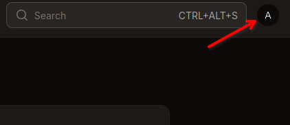
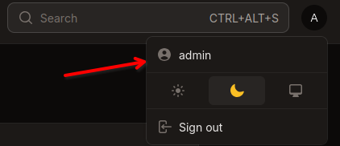

# Proxima Discord Bot

[Proxima](https://proxima.goliath.hu) is a **Remainder Application**, like many others, which primarily uses [Discord](https://discord.com/) to deliver the remainders to the user.

It provides an API interface to be embedded in other services, using Bearer Token Authentication.

The Discord bot provides basic functionality for convenience to the user as well.

This is the source code for the discord bot.

The bot allows the user to manage (add, edit, remove, list) its own remainders on the installed servers.

This bot is intended to be run as a docker container, see below.

For more details, see: [Proxima -> Discord Bot](https://proxima.goliath.hu#discord-bot)

# Main Technologies used
- Based on [commandstring/dphp-bot](https://github.com/CommandString/discordphp-bot-template) package
- [PHP 8.2+](https://www.php.net/)
- [composer](https://getcomposer.org/)
- [ReactPHP ](https://reactphp.org/)
- [discord-php/DiscordPHP](https://github.com/discord-php/DiscordPHP)
- [team-reflex/discord-php](https://github.com/discord-php/DiscordPHP)
- [Smarty](https://www.smarty.net/)
- and many more...

# What is needed to run the bot

- A working docker instance with compose.
- A Discord account: [Discord](https://discord.com/)
- A Discord application: [Discord Developer Portal](https://discord.com/developers/applications)
- A dedicated Discord server where the bot can send important notifications.

# Running with Docker compose

### Follow these easy steps to set up and your own bot:

> **NOTE:** The program inside the container is running under a **non-privileged** user with
>
> `UID:1000` and `GID:1000`.
>
> The storage folder **must** be writable for that user!
>
> In the example, we just make it writable to everyone (please use proper access control instead!)
>
> *Or you can build your own image with different `UID`/`GID` values.*

#### 1. Create the directory structure (bash)

```bash
mkdir -p volumes/bot/{storage,env}
```

#### 2. Update directory permissions to allow write access to the restricted docker user
***This is for demonstration only, please use proper access control!***

```bash
chmod o+w volumes/bot/storage
```

#### 3. Create the `.env` file from [src/.env.example](src/.env.example) file


```bash
wget -O volumes/bot/env/.env https://proxima.goliath.hu/proxima/discord-bot/raw/branch/main/src/.env.example

-OR-

curl -f -o volumes/bot/env/.env https://proxima.goliath.hu/proxima/discord-bot/raw/branch/main/src/.env.example
```

#### 4. Customize the `.env.config` file

```bash
nano volumes/bot/env/.env
```

#### 4.1 Fill in the bot application informations

- Change the `APPLICATION_ID` for the discord bot application id.

    see: [Discord Developer Portal](https://discord.com/developers/applications)

    `<YOUR_APPLICATION>` -> `General Information` -> `Application ID`

- Change the `PUBLIC_KEY` for the discord bot public key.

    see: [Discord Developer Portal](https://discord.com/developers/applications)

    `<YOUR_APPLICATION>` -> `General Information` -> `Public Key`

- Change the `TOKEN` for the discord bot token.

    see: [Discord Developer Portal](https://discord.com/developers/applications)

    `<YOUR_APPLICATION>` -> `Bot` -> `Token`

### 4.2 Fill in the bot home server informations

- Change the `HOME_SERVER_ID` for dedicated discord server ID.

    see: [Discord](https://discord.com/)

    ***NOTE: This can be used to manage the bot.***

- Change the `LOG_CHANNEL_ID` for dedicated channel on the discord server.

    see: [Discord](https://discord.com/)

    ***NOTE: The system messages will be sent here.***

### 4.3 Fill in the backend informations

- Fill in the `API_URL` for backend api url.

    ex.: `http://<your_backand_address>/api/v1/`

    ***NOTE: If it runs on localhost, teh address is:
    `http://backend:9000/api/v1/`***

#### 4.3.1 Get the authentication token from the backend

- Go visit the webpage backend `/admin` page and log in.

- Go to the your `Profile` page.

    
    

- Here you can change your `name`, `email`, `password` at any time.
hjfNdG68K2vbOrTn9bXVqDZBpNDER20rt5FRB1Sv2acd4353
- Click on the `Craete Token` button, and create an access token for the `Bot`.

- You can name the token anything you want.

- Make sure you check all the `Ablities` checkboxes.

- You can set an expire date if you want or leave empty (the token will not expire).

- Press `create` and copy the new `token` and temporary save it.
(If you lose it, you can always generate a new one, just delete the old now useless one).

#### 4.3.2 Fill in the authentication token

- Fill in the `BACKEND_TOKEN` for backend api token created by the **4.3.1** section.

### 5. Create the [`docker-compose.yaml`](res/docker-compose.yaml) file:

```yaml
---
services:
  discord-bot:
    image: proxima.goliath.hu/proxima/discord-bot:latest
    container_name: bot
    volumes:
      - "./volumes/bot/env/.env:/app/Bot/.env:ro"
      - "./volumes/bot/storage:/app/Bot/Storage"
    restart: unless-stopped
    networks:
      - proxima

networks:
  proxima:
    external: true

```

***NOTE: the external network is only neded if the backend and bot are on the same host, so they can communicate by the hostname.***

***You can create the network with the following command:***
```bash
docker network create proxima
```

### 6 Start up service

```bash
docker compose up -d
```
